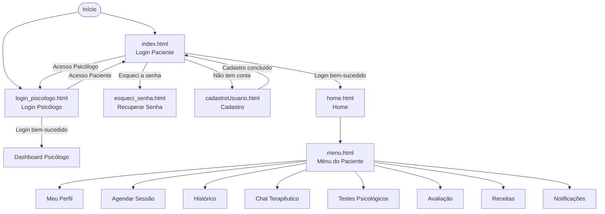
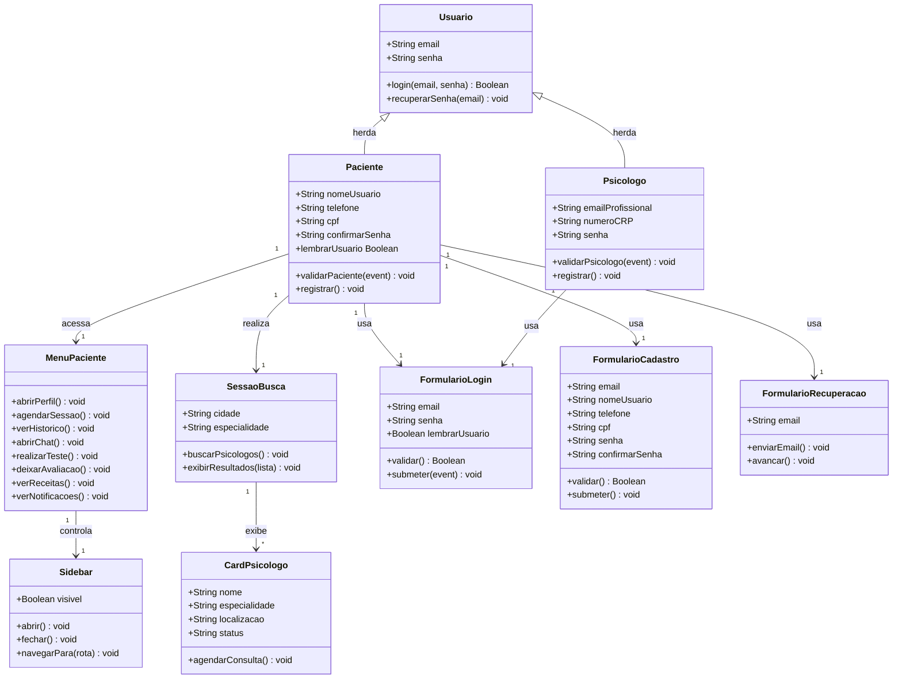
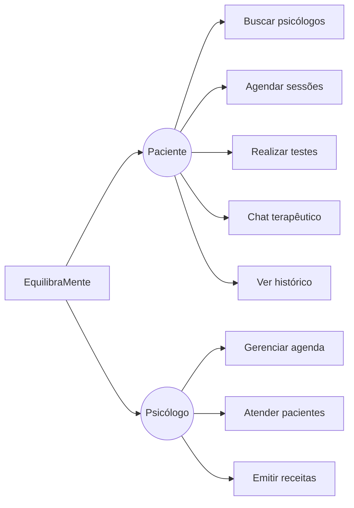

# EQUILIBRAMENTE_DOCUMENTACAO

# 🧠 EquilibraMente — Interface Web

> Plataforma de saúde mental que conecta pacientes a psicólogos, permitindo agendamento de sessões, testes psicológicos, chat terapêutico e acompanhamento de tratamento.

---

## 📁 Estrutura de Páginas

```
EQUILIBRAMENTE_INTERFACE/
├── index.html              # Login do Paciente
├── login_piscologo.html    # Login do Psicólogo
├── cadastroUsuario.html    # Cadastro de novo usuário
├── esqueci_senha.html      # Recuperação de senha
├── home.html               # Home — busca de psicólogos
├── menu.html               # Menu da Área do Paciente
├── css/
│   ├── login.css
│   ├── home.css
│   └── menu.css
├── js/
│   ├── login.js
│   ├── home.js
│   └── menu.js
└── img/
    ├── aluna_imagem.png
    └── piscologo_imagem.png
```

---

## 🗺️ Diagrama de Fluxo de Navegação



---

## 📐 Diagrama de Classes



---

## ⚙️ Funcionalidades por Página

### 🔐 `index.html` — Login do Paciente
| Funcionalidade | Descrição |
|---|---|
| Autenticação por e-mail e senha | Validação via `validarPaciente(event)` em `login.js` |
| Lembrar usuário | Checkbox para persistir sessão |
| Recuperação de senha | Link para `esqueci_senha.html` |
| Cadastro | Link para `cadastroUsuario.html` |
| Acesso alternativo | Link para login do psicólogo |

---

### 🩺 `login_piscologo.html` — Login do Psicólogo
| Funcionalidade | Descrição |
|---|---|
| Autenticação profissional | E-mail profissional + número CRP + senha |
| Validação do CRP | Campo com placeholder `Ex.: 04/12345` |
| Redirecionamento | Link de volta ao login do paciente |
| Cadastro de psicólogo | Link para `/register_psicologo` |

---

### 📝 `cadastroUsuario.html` — Cadastro de Usuário
| Funcionalidade | Descrição |
|---|---|
| Coleta de e-mail | Campo de e-mail com validação HTML5 |
| Nome de usuário | Campo de identificação do paciente |
| Telefone | Contato do paciente |
| CPF | Documento de identificação |
| Senha e confirmação | Campos de senha com confirmação |
| Submissão | Botão com chamada a `validarPaciente()` |

> ⚠️ **Nota técnica:** Os campos de nome de usuário, telefone e CPF estão com `type="password"` — devem ser corrigidos para `type="text"` e `type="tel"`.

---

### 🔑 `esqueci_senha.html` — Recuperação de Senha
| Funcionalidade | Descrição |
|---|---|
| Envio de e-mail | Usuário informa o e-mail cadastrado |
| Avançar | Envia solicitação de recuperação via POST |

---

### 🏠 `home.html` — Página Inicial (Pós-login)
| Funcionalidade | Descrição |
|---|---|
| Saudação personalizada | Exibe "Olá, Paciente 👋" no header |
| Menu lateral (Sidebar) | Abre/fecha via botão de configurações (⚙️) |
| Busca de psicólogos | Filtro por cidade/bairro e especialidade |
| Especialidades disponíveis | Ansiedade, Depressão, Relacionamentos, Psicologia Infantil, Carreira |
| Cards de psicólogos | Exibe nome, especialidade, localização e status de disponibilidade |
| Agendar consulta | Botão em cada card para marcar atendimento |
| Navegação completa | Sidebar com 13 opções de menu incluindo Sair |

**Itens do menu lateral:**
- Menu principal, FAQ, Perfil Paciente, Perfil Psicólogos
- Atendimento, Marcar Atendimento, Teste Psicológico
- Resultados, Calendário, Chat, Avaliação
- Trocar de conta, Sair

---

### 📋 `menu.html` — Área do Paciente
| Card | Funcionalidade |
|---|---|
| 👤 Meu Perfil | Visualizar e editar informações pessoais |
| 📅 Agendar Sessão | Marcar novos atendimentos online (redireciona para `usuarioLogado.html`) |
| 📄 Histórico | Ver sessões e evoluções anteriores |
| 💬 Chat Terapêutico | Conversar com o psicólogo |
| ✅ Testes Psicológicos | Realizar avaliações online |
| ⭐ Avaliação | Deixar opinião sobre o atendimento |
| 🗒️ Receitas | Acessar prescrições médicas |
| 🔔 Notificações | Ver avisos e lembretes |

---

## 🔧 Scripts JavaScript

| Arquivo | Função |
|---|---|
| `js/login.js` | `validarPaciente(event)` e `validarPsicologo(event)` — autenticação dos dois perfis |
| `js/home.js` | `buscarPsicologos()` — filtragem e exibição de cards; controle da sidebar |
| `js/menu.js` | Lógica de navegação entre cards do menu do paciente |

---

## 🎨 Estilização (CSS)

| Arquivo | Escopo |
|---|---|
| `css/login.css` | Login do paciente, psicólogo, cadastro e recuperação de senha |
| `css/home.css` | Layout da home, sidebar, busca e cards de psicólogos |
| `css/menu.css` | Grid de cards do menu da área do paciente |

**Fontes e ícones utilizados:**
- [Inter](https://fonts.google.com/specimen/Inter) (Google Fonts)
- [Font Awesome 6](https://fontawesome.com/) (ícones da home e sidebar)

---

## 🚧 Melhorias Sugeridas

- [ ] Corrigir `type="password"` nos campos de nome, telefone e CPF em `cadastroUsuario.html`
- [ ] Fechar as tags `</form>`, `</div>` e `</body>` corretamente em `cadastroUsuario.html`
- [ ] Adicionar link funcional em `esqueci_senha.html` (tag `<a>` vazia)
- [ ] Implementar rotas reais para todas as opções do menu lateral em `home.html`
- [ ] Criar a página `usuarioLogado.html` referenciada em `menu.html`
- [ ] Adicionar `href` para "Esqueci a senha" em `index.html`
- [ ] Padronizar o título da aba — algumas páginas usam `"login"` genérico

---

## 👥 Perfis de Usuário



---

© 2026 Clínica Equilibra Mente | Psicologia & Bem-estar
